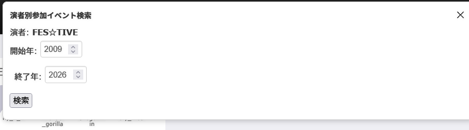
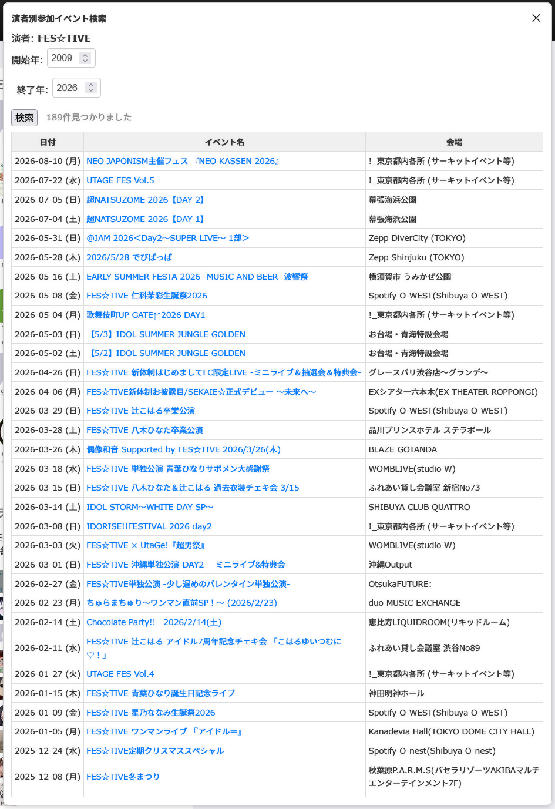

# eventernote-addon

[Eventernote](https://www.eventernote.com/) を便利にする Tampermonkey / Greasemonkey 用ユーザースクリプト集です。

## スクリプト一覧

### 演者別参加イベント一覧 ([actor-join-list.user.js](scripts/actor-join-list.user.js))

演者ページ (`/actors/*`) を開いたとき、**その演者が出演している自分の参加イベント**を年度範囲で一覧表示します。

### 会場別参加イベント一覧 ([place-join-list.user.js](scripts/place-join-list.user.js))

会場ページ (`/places/*`) を開いたとき、**その会場で開催された自分の参加イベント**を年度範囲で一覧表示します。

## インストール

以下のいずれかのアドオンを導入してください。

| アドオン | 対応ブラウザ |
|---|---|
| [Tampermonkey](https://www.tampermonkey.net/) | Chrome / Firefox / Edge / Safari |
| [Greasemonkey](https://www.greasespot.net/) | Firefox |

1. 上記いずれかのアドオンをブラウザに導入する
2. 使いたいスクリプトのファイルをこのリポジトリで開き、**Raw** ボタンをクリックする
   - アドオンがインストール画面を自動で開くので、**「インストール」** をクリックする
3. 後述の **初期設定** を行ってから保存する

> Rawボタンから自動インストールできない場合は、スクリプトの内容をコピーしてアドオンの「新しいスクリプト」に貼り付けてください。

## 初期設定

各スクリプトの **12行目付近** にある以下の2行を **自分のアカウント情報** に書き換えてください。

```js
const userId = 'YOUR_USER_ID';  // Eventernoteのユーザー名（URLに表示されるもの）
const numericId = 0;            // 数字のID（下記参照）
```

### 数字IDの確認方法

Eventernote にログインした状態で以下のURLにアクセスすると、URLの中に数字のIDが含まれます。

```
https://www.eventernote.com/users/icalendar
```

例: `https://www.eventernote.com/users/12345/icalendar` → `numericId = 12345`

## 使い方

設定後、対象ページを開くと画面右上に検索パネルが表示されます。開始年・終了年を指定して「検索」ボタンを押すと、条件に一致する参加イベントが一覧で表示されます。





## カスタマイズ

スクリプトを直接編集することで以下の項目を変更できます。

**開始年のデフォルト値**（35行目）

```js
value="2009"
```

作者の最古の参加イベントが2009年のためこの値にしていますが、自分の参加歴に合わせて変更すると検索が速くなります。

**パネルの幅**（23行目）

```js
width: 800px
```

画面サイズに合わせて調整してください。

**結果一覧の最大高さ**（42行目）

```js
max-height: 1000px
```

結果が多い場合にスクロールが発生する高さです。画面サイズに合わせて調整してください。
